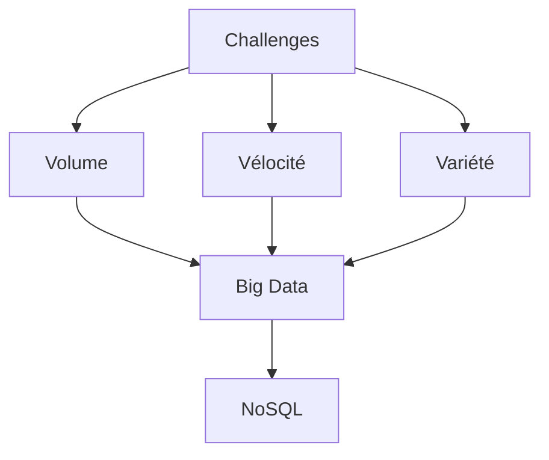
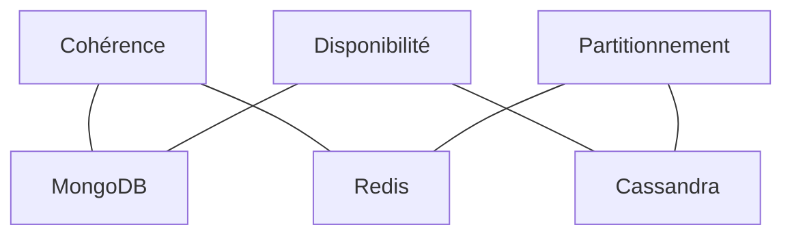
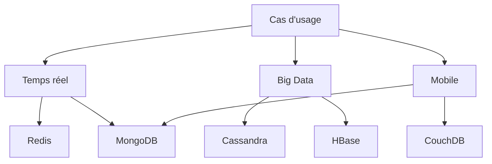
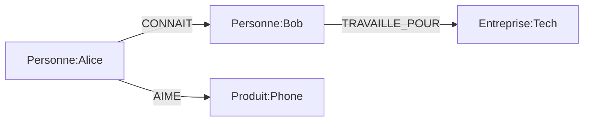
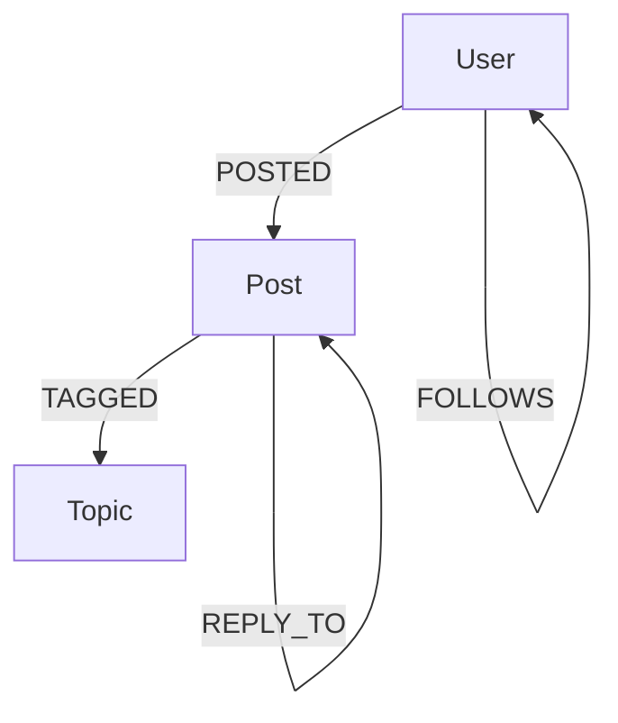

# Bases de données NoSQL


---
layout: two-cols-header
---


# Qui suis-je?

- 🧑🏾 **Nom**: Brice FOTZO
- 🌍 **Origine**: Bafoussam, Cameroun
- 🎓 **Formation**: Ingénieur Généraliste(BDTN) - ESIGELEC Rouen

> Parcours Data & AI
- Analytics Engineer - **Apprenti** @ Renault
- Data Enigneer - CDI @ Starclay
- Tech Lead Data - CDI @ HephIA
- Tech Lead Data - CDI @ Servier
- Intervenant - CDD @ ESIGELEC Rouen/Poitiers

> Engagements Communautaires
- Data Engineer - **Volunteer** @ Validalab(DFG)
- MUG Leader Paris - **Volunteer** @ MongoDB
- Créateur de contenu @ LinkedIn, Medium
- Créateur de Serial Techos

---
layout: default
---

# Et vous?
## Faisons connaissance

---
layout: two-cols-header
---

# Plan du module


::left::
- **Introduction au NoSQL** 
  - Pourquoi NoSQL ?
  - Théorème CAP
  - Types de bases NoSQL
  - Comparaison SQL vs NoSQL

- **MongoDB** 
  - Introduction et concepts
  - Structure des données
  - Opérations CRUD
  - Requêtes avancées
  - Indexation et modélisation

::right::

- **Neo4j** 
  - Base de données orientée graphe
  - Langage Cypher
  - Modélisation de graphes
  - Cas d'utilisation

- **Travaux Pratiques** - 
  - Exercices MongoDB
  - Exercices Neo4j
  - Mise en pratique

---
layout: two-cols-header
---

# Organisation de la journée

::left::
**Matin (9h00 - 12h00) - 3h**
  - Introduction NoSQL - 1h
  - MongoDB théorie - 1h30
  - Exercices MongoDB - 30min

**Après-midi (13h30 - 17h30) - 4h**
  - Pratique MongoDB - 1h
  - Neo4j théorie - 1h30
  - Exercices Neo4j - 30min
  - Pratique Neo4j - 1h

::right::

**Ressources**

- Support de cours - Slides
- Exercices - GitHub
- Environnement Docker pour la pratique
- Notebooks Jupyter pour les TDs

---
layout: two-cols-header
---

# Objectifs d'apprentissage

::left::

- **Compétences visées**:
   - Maîtriser les différences entre SQL et NoSQL
   - Choisir les BDD adaptées à un besoin
   - Manipuler des BDD dans une app *Python*
   - Déployer des bases de données NoSQL
   - Modéliser efficacement en NoSQL


::right::
- **Technologies et outils**:
   - BDD: `MongoDB`, `Neo4j`
   - Virtualization: `Docker`
   - Code: `Python`
   - Cloud: `MongoDB Atlas`, `Neo4j Aura`


---
layout: cover
background: https://source.unsplash.com/collection/94734566/1920x1080
---

# Introduction au NoSQL
## Au-delà du relationnel

---
layout: two-cols-header
---

# Qu'est-ce que le NoSQL ?

::left::

<div class="mb-6">

### Origine
**11 juin 2009** à San Francisco
- Meetup organisé par Johan Oskarsson
- Émergence d'un nouveau paradigme

</div>

<div>

### Définitions
- **No SQL** : N'utilisent pas un modèle relationnel (ni le langage SQL)
- **Not only SQL** : Bases non relationnelles complémentaires

</div>

::right::

<div>

### Caractéristiques principales
- ✅ Open source
- ✅ Conçus pour des clusters puissants
- ✅ Basés sur les besoins du web au 21ème siècle
- ✅ Pas de schéma fixe
- ✅ Permet l'ajout de champs sans contrôles

</div>

---
layout: default
---

# Évolution historique

<div class="grid grid-cols-3 gap-4">

<div>

### 1970-2000
**Ère des SGBD traditionnels**
- Domination des bases relationnelles
- SQL comme standard
- Oracle, MySQL, PostgreSQL

</div>

<div>

### 2000-2010
**Émergence du NoSQL**
- Bulle internet
- Papiers de recherche (Google, Facebook, IBM)
- BDD open source (MongoDB, CouchDB, Neo4j, Redis, Cassandra, HBase, Riak)

</div>

<div>

### 2010-Aujourd'hui
**Ère du Cloud DBaaS**
- MongoDB Atlas
- AWS DynamoDB
- Google Cloud Firestore
- Azure Cosmos DB
- Cloudant

</div>

</div>

---
layout: two-cols-header
---

# Pourquoi NoSQL ?

::left::

<div class="mb-6">

### Limites du SQL
- Schéma rigide
- Scalabilité verticale
- Performances avec grands volumes
- Structures complexes
- Coût des jointures

</div>

<div>

### Besoins modernes
- Données non structurées
- Scalabilité horizontale
- Haute disponibilité
- Temps réel
- Agilité de développement

</div>

::right::



---
layout: default
---

# Le théorème CAP

<div class="grid grid-cols-3 gap-4">

<div>

### Cohérence
- Tous les nœuds voient les mêmes données
- Lectures cohérentes
- Transactions ACID

</div>

<div>

### Disponibilité
- Chaque requête reçoit une réponse
- Sans erreur
- Sans garantie de fraîcheur

</div>

<div>

### Tolérance au partitionnement
- Le système continue de fonctionner
- Malgré les pertes de messages
- Ou pannes réseau

</div>

</div>

<div class="mt-8">



</div>

---
layout: two-cols-header
---

# Types de bases NoSQL

::left::

<div class="mb-6">

### Document (MongoDB)
```json
{
  "id": 1,
  "nom": "Dupont",
  "adresses": [
    {
      "type": "domicile",
      "ville": "Paris"
    },
    {
      "type": "travail",
      "ville": "Lyon"
    }
  ]
}
```

</div>

<div>

### Clé-valeur (Redis)
```bash
SET user:1:nom "Dupont"
SET user:1:email "dupont@mail.com"
HSET user:1 nom "Dupont" email "dupont@mail.com"
```

</div>

::right::

<div class="mb-6">

### Colonnes (Cassandra)
```sql
CREATE TABLE users (
  user_id uuid,
  year int,
  month int,
  events map<timestamp, text>,
  PRIMARY KEY ((user_id), year, month)
);
```

</div>

<div>

### Graphe (Neo4j)
```cypher
CREATE (u:User {name: 'Dupont'})
CREATE (p:Post {title: 'NoSQL'})
CREATE (u)-[:AUTHORED]->(p)
```

</div>

---
layout: two-cols-header
---

# Caractéristiques des BDD NoSQL

::left::

<div class="mb-4">

### 🌐 Communautés impliquées et actives
- Proviennent de l'Open Source ou ont une version Open Source
- Support des communautés fondamental pour la croissance
- **Exemples** :
  - MongoDB : 635 contributeurs
  - Cassandra : 377 contributeurs
  - Redis : 630 contributeurs

</div>

<div class="mb-4">

### 📊 Passage à l'échelle (Scalabilité)

**Scalabilité Horizontale** ✅
- Ajout de serveurs de même capacité
- Ex: 8 serveurs 2vCPUs/4Go
- Approche privilégiée par NoSQL

**Scalabilité Verticale** ❌
- Augmentation de la puissance d'un serveur
- Plus coûteuse et limitée

</div>

::right::

<div class="mb-4">

### ✅ Disponibilité garantie
- Serveur unique : Point de défaillance unique
- Cluster de serveurs : Réplication des données
- Haute disponibilité native

</div>

<div class="mb-4">

### ☁️ Cloud Ready et coûts réduits
- Architectures Cloud natives
- Paradigme Cloud intégré
- Serveurs standards, open source
- Implémentation peu coûteuse

**Exemple de coût** :
- MongoDB Enterprise : **0$**
- Oracle RAC : **$47,500** par unité

</div>

<div class="mb-4">

### ⚡ Hautes performances
- ⏱️ Réponse rapide
- 👥 Haute concurrence
- Nombreux utilisateurs simultanés

</div>

<div>

### 🔄 Flexibilité
- Schéma flexible : Modification à la volée
- Types de données variés
- Indexage spécifique
- Dénormalisation acceptée

</div>


---
layout: default
---

# Comparaison SQL vs NoSQL

<div class="grid grid-cols-2 gap-4">

<div>

### SQL
- Schéma fixe
- Relations
- Transactions ACID
- Jointures
- Scalabilité verticale
- Requêtes complexes
- Cohérence forte

</div>

<div>

### NoSQL
- Schéma flexible
- Documents imbriqués
- BASE (Basic Availability)
- Dénormalisation
- Scalabilité horizontale
- Requêtes simples
- Cohérence éventuelle

</div>

</div>

<div class="mt-6">

### Critères de choix
1. Nature des données (structurées vs non structurées)
2. Volume et croissance prévue
3. Patterns d'accès (lectures vs écritures)
4. Besoins en cohérence
5. Expertise de l'équipe

</div>

---
layout: two-cols-header
---

# Cas d'usage

::left::

<div class="mb-4">

### Applications idéales
- Réseaux sociaux
- IoT / Big Data
- Logging
- E-commerce
- Temps réel
- Contenu mobile

</div>

<div>

### Exemples concrets
- Facebook : Cassandra
- LinkedIn : MongoDB
- Twitter : Redis
- Amazon : DynamoDB

</div>

::right::



---
layout: iframe
url: https://app.wooclap.com/NFMFFF/questionnaires/690a8cebb1bf86ff9eac1762
---

---
layout: cover
---

# MongoDB
## Une base de données orientée document

---
layout: default
---

# Qu'est-ce que MongoDB ?

### Caractéristiques principales
- Base de données NoSQL orientée document
- Documents au format BSON (Binary JSON)
- Schéma flexible et dynamique
- Scalabilité horizontale native
- Haute disponibilité avec la réplication

### Architecture
- Collections ≈ Tables en SQL
- Documents ≈ Lignes en SQL
- Champs ≈ Colonnes en SQL
- Index supportés
- Pas de jointures natives

---
layout: two-cols-header
---

# Structure des données

::left::

### Document BSON
```json
{
  "_id": ObjectId("5f7d3"),
  "nom": "Dupont",
  "age": 30,
  "adresses": [
    {
      "type": "domicile",
      "ville": "Paris",
      "code_postal": "75001"
    },
    {
      "type": "travail",
      "ville": "Lyon",
      "code_postal": "69001"
    }
  ],
  "tags": ["VIP", "Premium"]
}
```

::right::

### Types de données
- Strings
- Numbers (Integer, Float, Decimal)
- Dates
- Boolean
- Arrays
- Embedded Documents
- ObjectId
- Null
- Binary Data
- Regular Expression

---
layout: two-cols-header
---

# Opérations CRUD

::left::

### Create
```javascript
// Insérer un document
db.clients.insertOne({
  nom: "Dupont",
  age: 30
})

// Insérer plusieurs documents
db.clients.insertMany([
  { nom: "Martin", age: 25 },
  { nom: "Bernard", age: 35 }
])
```

### Read
```javascript
// Trouver tous les clients
db.clients.find()

// Avec filtre
db.clients.find({
  age: { $gt: 30 }
})
```

::right::

### Update
```javascript
// Modifier un document
db.clients.updateOne(
  { nom: "Dupont" },
  { $set: { age: 31 } }
)

// Modifier plusieurs documents
db.clients.updateMany(
  { age: { $lt: 30 } },
  { $set: { statut: "jeune" } }
)
```

### Delete
```javascript
// Supprimer un document
db.clients.deleteOne({
  nom: "Dupont"
})

// Supprimer plusieurs documents
db.clients.deleteMany({
  age: { $lt: 25 }
})
```

---
layout: default
---

# Requêtes avancées

### Opérateurs de comparaison
```javascript
{
  age: { $gt: 25 },        // plus grand que
  prix: { $lte: 100 },     // plus petit ou égal
  statut: { $ne: "inactif" }, // différent de
  tags: { $in: ["VIP", "Premium"] } // dans la liste
}
```

### Opérateurs logiques
```javascript
{
  $and: [
    { age: { $gt: 25 } },
    { ville: "Paris" }
  ],
  $or: [
    { statut: "VIP" },
    { points: { $gt: 100 } }
  ]
}
```

---
layout: two-cols-header
---

# Indexation avec MongoDB

::left::

### Types d'index
- Single Field Index
- Compound Index
- Text Index
- Geospatial Index
- ...

### Création d'index
```javascript
// Index simple
db.clients.createIndex({ nom: 1 })

// Index composé
db.clients.createIndex(
  { ville: 1, age: -1 }
)

// Index unique
db.clients.createIndex(
  { email: 1 },
  { unique: true }
)
```

::right::

### Bonnes pratiques
- Index sur les champs fréquemment recherchés
- Attention aux index composés : ordre important
- Éviter la sur-indexation
- Utiliser explain() pour analyser
- Index en arrière-plan pour la production

### Analyse des index
```javascript
// Analyser une requête
db.clients.find({
  ville: "Paris"
}).explain("executionStats")

// Liste des index
db.clients.getIndexes()

// Statistiques d'index
db.clients.stats()
```

---
layout: two-cols-header
---

# Cas d'utilisation de MongoDB

::left::

### Idéal pour
- Applications web modernes
- Contenu varié et évolutif
- Données semi-structurées
- Besoin de scalabilité horizontale
- Développement agile
- Applications temps réel

::right::

### Exemples concrets
1. **E-commerce**
   - Catalogues de produits
   - Paniers utilisateurs
   - Historique des commandes

2. **Applications mobiles**
   - Profils utilisateurs
   - Contenu généré par les utilisateurs
   - Données de géolocalisation

3. **Analytics**
   - Logs d'événements
   - Données IoT
   - Métriques en temps réel

---
layout: two-cols-header
---

# Modélisation des données

::left::

### Patterns de conception
- Embedded Documents
```javascript
{
  _id: 1,
  item: "Xbox Series X",
  manufacturer: {
    name: "Microsoft",
    address: "Redmond, WA",
    phone: "123-456-7890"
  }
}
```

- References
```javascript
{
  _id: 1,
  item: "Xbox Series X",
  manufacturer_id: 123
}
```

::right::

### Bonnes pratiques
- Privilégier l'embedding pour les relations 1:1
- Utiliser les références pour les relations N:M
- Dénormaliser stratégiquement
- Limiter la taille des documents
- Concevoir pour les cas d'utilisation

### Anti-patterns
- Jointures côté application excessive
- Documents trop profonds
- Arrays non bornés
- Références en cascade

---
layout: iframe
url: https://app.wooclap.com/NFMFFF/questionnaires/690a8cebb1bf86ff9eac1763
---
---
layout: cover
# background: './images/pont.png'
---

# Neo4j
## Base de données orientée graphe

---
layout: two-cols-header
# image: '/images/ponts.png'
---
# Le problème des 7 ponts

::left::

**Ponts de Koenigsberg**

<div class="mr-4 mt-6">

</div>

::right::

**Vue simplifiée**

<div class="mr-4 mt-6">
  
</div>

---
layout: default
# image: '/images/ponts.png'
---
# Le problème des 7 ponts


<div class="mr-4 mt-6">
  
</div>

---
layout: default
---

# Qu'est-ce que Neo4j ?


### Caractéristiques principales
- Base de données orientée graphe
- Modélisation naturelle des relations
- Langage de requête Cypher
- ACID compliant
- Très performant pour les données connectées

### Architecture
- Nœuds (Nodes) ≈ Entités
- Relations (Relationships) ≈ Connexions
- Propriétés ≈ Attributs
- Labels ≈ Types de nœuds
- Types de relations

---
layout: two-cols-header
---

# Structure d'un graphe

::left::

### Éléments de base


### Types de nœuds (Labels)
- Personne
- Entreprise
- Produit
- Lieu
- Événement

::right::

### Relations et propriétés
```cypher
CREATE (p:Personne {
  nom: "Alice",
  age: 30
})-[r:TRAVAILLE_POUR {
  depuis: "2020",
  poste: "Développeur"
}]->(e:Entreprise {
  nom: "Tech Corp",
  secteur: "IT"
})
```

---
layout: two-cols-header
---

# Langage Cypher

::left::

### Création de nœuds
```cypher
// Créer un nœud
CREATE (p:Personne {
  nom: "Alice",
  age: 30
})

// Créer une relation
MATCH (a:Personne {nom: "Alice"})
MATCH (b:Personne {nom: "Bob"})
CREATE (a)-[r:CONNAIT]->(b)
```

### Lecture
```cypher
// Trouver des nœuds
MATCH (p:Personne)
WHERE p.age > 25
RETURN p

// Avec relations
MATCH (p:Personne)-[r:TRAVAILLE_POUR]->(e:Entreprise)
RETURN p, r, e
```

::right::

### Modification
```cypher
// Mettre à jour un nœud
MATCH (p:Personne {nom: "Alice"})
SET p.age = 31

// Modifier une relation
MATCH ()-[r:TRAVAILLE_POUR]->()
SET r.poste = "Senior Dev"
```

### Suppression
```cypher
// Supprimer un nœud
MATCH (p:Personne {nom: "Alice"})
DELETE p

// Supprimer une relation
MATCH ()-[r:CONNAIT]->()
DELETE r
```

---
layout: default
---

# Requêtes avancées

### Navigation dans le graphe
```cypher
// Chemins de longueur variable
MATCH (a:Personne {nom: "Alice"})-[*1..3]->(b)
RETURN b

// Plus court chemin
MATCH p=shortestPath(
  (a:Personne)-[*]->(b:Personne)
)
WHERE a.nom = "Alice" AND b.nom = "Charlie"
RETURN p
```

### Agrégation et patterns complexes
```cypher
// Groupement et comptage
MATCH (p:Personne)-[:TRAVAILLE_POUR]->(e:Entreprise)
RETURN e.nom, count(p) as nb_employes
ORDER BY nb_employes DESC

// Pattern complexe
MATCH (p1:Personne)-[:CONNAIT]->(p2:Personne)-[:TRAVAILLE_POUR]->(e:Entreprise)
WHERE p1.nom = "Alice" AND e.secteur = "IT"
RETURN DISTINCT p2.nom as contacts_it
```

---
layout: two-cols-header
---

# Modélisation avec Neo4j

::left::

### Bonnes pratiques
1. **Labels**
   - Utilisez des labels multiples
   - Hiérarchie de labels
   - Nommage clair

2. **Relations**
   - Direction significative
   - Nommage explicite
   - Propriétés utiles

3. **Propriétés**
   - Attributs atomiques
   - Indexation stratégique
   - Pas de tableaux complexes

::right::

### Patterns communs


### Anti-patterns
- Relations sans direction
- Propriétés redondantes
- Sur-utilisation des labels
- Relations génériques

---
layout: two-cols-header
---

# Indexation et Performances

::left::

### Types d'index
- Indexes par label/propriété
- Composite indexes
- Full-text indexes
- Range indexes

### Création d'index
```cypher
// Index simple
CREATE INDEX FOR (p:Personne)
ON (p.nom)

// Index composé
CREATE INDEX FOR (p:Personne)
ON (p.nom, p.age)

// Index full-text
CREATE FULLTEXT INDEX personneSearch
FOR (p:Personne)
ON EACH [p.nom, p.description]
```

::right::

### Optimisation
1. **Stratégies d'indexation**
   - Index sur les propriétés filtrées
   - Index sur les propriétés de jointure
   - Éviter la sur-indexation

2. **Analyse des performances**
   ```cypher
   PROFILE
   MATCH (p:Personne)-[:CONNAIT]->()
   RETURN p.nom, count(*) as relations
   ```

3. **Monitoring**
   - Utilisation de la mémoire
   - Temps de réponse
   - Cache hits/misses

---
layout: default
---

# Cas d'utilisation de Neo4j

### Idéal pour
- Réseaux sociaux
- Systèmes de recommandation
- Détection de fraude
- Graphes de connaissances
- Gestion des identités
- Analyse d'impact

### Exemples concrets
1. **Réseaux sociaux**
```cypher
// Trouver les amis des amis
MATCH (p:Personne {nom:"Alice"})-[:CONNAIT]->(ami)-[:CONNAIT]->(amiDami)
WHERE NOT (p)-[:CONNAIT]->(amiDami)
RETURN DISTINCT amiDami.nom as suggestions
```

2. **Recommandations**
```cypher
// Produits fréquemment achetés ensemble
MATCH (p:Produit)<-[:A_ACHETE]-(c:Client)-[:A_ACHETE]->(autreProduit:Produit)
WHERE p.id = "123"
RETURN autreProduit.nom, count(*) as frequence
ORDER BY frequence DESC
LIMIT 5
```

3. **Détection de fraude**
```cypher
// Identifier les cycles de transactions suspects
MATCH chemin = (c:Compte)-[:TRANSFERT*3..5]->(c)
WHERE ALL(r IN relationships(chemin) WHERE r.montant > 10000)
RETURN chemin
```
---
layout: iframe
url: https://app.wooclap.com/NFMFFF/questionnaires/690a8cebb1bf86ff9eac1764
---

---
layout: cover
---


# Travaux Pratiques
## NoSQL en pratique - Mise en application

---
layout: default
---

# Organisation du TP

### Durée totale : 2 heures
- Exercices simples MongoDB : 30 minutes
- Pratique MongoDB avec Docker : 30 minutes
- Exercices simples Neo4j : 30 minutes
- Pratique Neo4j avec Docker : 30 minutes

### Objectifs
- Mettre en pratique les concepts vus en cours
- Développer des compétences pratiques sur MongoDB et Neo4j
- Comprendre les cas d'usage spécifiques
- Utiliser les outils en ligne et Docker

### Ressources
- Exercices en ligne (sans installation)
- Environnement Docker pour pratique avancée
- Notebooks Jupyter pour l'intégration Python

---
layout: default
---

# Merci !

## Questions ?

**Ressources**
- Documentation MongoDB: https://docs.mongodb.com
- Documentation Neo4j: https://neo4j.com/docs
- Repository GitHub: [lien vers le repo]

**Contact**
- Email: brice.fotzo@hotmail.com
- LinkedIn: Brice FOTZO
